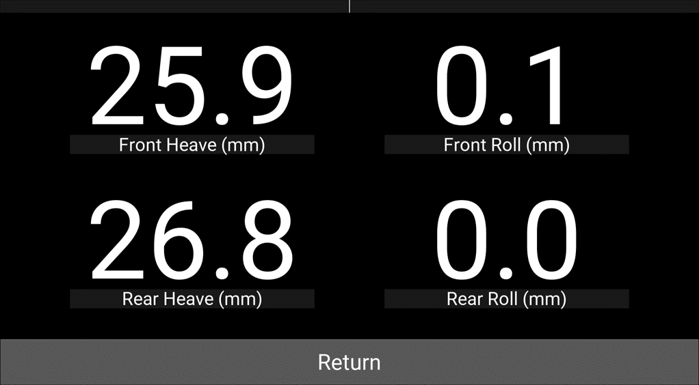

# Dash
This code uses Python and Kivy. It was created to receive and transmit CAN to an ECU. 
'Dash' is the original code that was created. The 'Dash with Buttons' is our newest code that we use. This code can be used with physical buttons to navigate the dash. The buttons are connected to the GPIO pins on the Raspberry Pi.
## Materials
Raspberry Pi  
CANable USB to CAN adapter 
  https://canable.io/  
Raspberry Pi compatible touch screen  
Micro SD card 32GB class10 U1
 
## Raspberry Pi Setup
1. Download 'Raspberry Pi OS Lite' https://www.raspberrypi.org/software/operating-systems/
2.	https://www.balena.io/etcher/
This is for writing the image file to the sd card. After you are done with burning the image there will be a drive named "boot" show up.
Open it, and create a blank text file named "ssh" (delete the extension ".txt").
3. SSH into the Raspberry Pi. Host name 'pi@raspberrypi'. 'raspberry' for password.
4. `sudo apt update`
5. `sudo apt upgrade`
6. Check the version of python `python3 -version` Anything between 3.6 to 3.9 is OK
7. `sudo apt update
    sudo apt install pkg-config libgl1-mesa-dev libgles2-mesa-dev \
    libgstreamer1.0-dev \
    gstreamer1.0-plugins-{bad,base,good,ugly} \
    gstreamer1.0-{omx,alsa} libmtdev-dev \
    xclip xsel libjpeg-dev`
8. `sudo apt install libsdl2-dev libsdl2-image-dev libsdl2-mixer-dev libsdl2-ttf-dev`
9. Make sure pip3 is intalled. `pip3`. If not installed use `sudo apt install python3-pip`
10. Install Kivy `pip3 install kivy[base]`
11. `python3`
12. `import kivy`
13. Exit python `exit()`
14. `sudo apt fbi`
15. The cmdline.txt and config.txt are provided in the 'Pi Mod' folder. These files are found on the SD card. 

## Tips

Kivy introduction Youtube playlist https://youtube.com/playlist?list=PLzMcBGfZo4-kSJVMyYeOQ8CXJ3z1k7gHn   

To test the code on a computer comment out line 133

`CanBus = can.ThreadSafeBus(interface='socketcan', channel='can0', bitrate=1000000)`  

and line 2  

`import can` 

For 'Dash with Buttons' the settings screen is hidden in the top right corner over the 'ODO'. 

## Screen

##### Figure 1: Main Screen

##### Figure 2: Drive Mode 

##### Figure 3: Brake

##### Figure 4: Suspension

